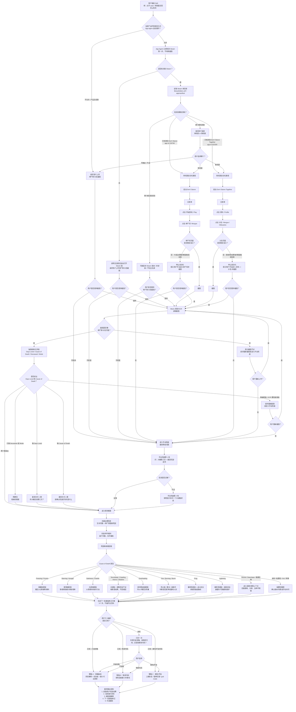
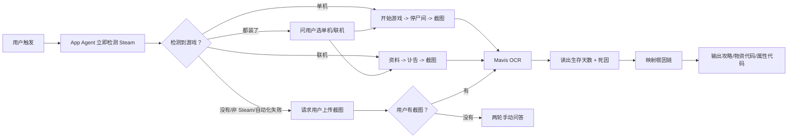

# Mavis 饥荒死因分析 Skill 判定流程图

这张图描述 Skill 从用户触发到最终输出的完整分支：用户触发后立刻由 App Agent 检测 Steam，随后检测单机/联机安装，能自动化就直接进入停尸房/讣告截图；只有自动化不可用时，才请求用户上传截图；仍没有截图时才进入手动问答兜底。

```mermaid
flowchart TD
    A["用户触发 Skill<br/>例：点开 case / 帮我看饥荒怎么死的"] --> D{"当前产品环境是否允许<br/>App Agent 自动操作？"}

    D -- "不允许 / 产品无权限" --> X0["请求用户上传<br/>停尸房/讣告截图"]
    D -- "允许" --> E["App Agent 立即检测 Steam<br/>第一步，不判断截图"]

    E --> F{"是否检测到 Steam？"}
    F -- "否" --> F1["说明无法稳定自动打开 Steam 版<br/>请求用户上传停尸房/讣告截图"]
    X0 --> X1{"用户是否提供截图？"}
    X1 -- "提供" --> C["Mavis 视觉/OCR<br/>读取截图"]
    X1 -- "不提供" --> M0["进入手动兜底<br/>最多两轮问题"]

    F1 --> F2{"用户是否提供截图？"}
    F2 -- "提供" --> C
    F2 -- "不愿意" --> M0

    F -- "是" --> G["读取 Steam 库目录<br/>libraryfolders.vdf / appmanifest"]
    G --> H{"检测到哪些游戏？"}

    H -- "只检测到 Don't Starve<br/>app id 219740" --> I["单机版自动化路径"]
    H -- "只检测到 Don't Starve Together<br/>app id 322330" --> J["联机版自动化路径"]
    H -- "两个都检测到" --> K["询问用户选择<br/>单机版 or 联机版"]
    H -- "两个都没检测到" --> H1["可能是非 Steam 版本 / 未安装 / 不在白名单"]
    H1 --> H2{"用户是否提供<br/>停尸房/讣告截图？"}
    H2 -- "提供" --> C
    H2 -- "不愿意" --> M0

    K --> K1{"用户选择哪个？"}
    K1 -- "单机版" --> I
    K1 -- "联机版" --> J
    K1 -- "不确定 / 不选" --> X0

    I --> I1["启动 Don't Starve"]
    I1 --> I2["主菜单"]
    I2 --> I3["点击 开始游戏 / Play"]
    I3 --> I4["点击 停尸间 / Morgue"]
    I4 --> I5{"停尸间页面<br/>是否稳定显示？"}
    I5 -- "是" --> I6["截图"]
    I6 --> C
    I5 -- "否：卡启动/更新/弹窗/路径失败" --> I7["停止自动化<br/>提示用户手动进入停尸间并截图"]
    I7 --> I8{"用户是否提供截图？"}
    I8 -- "是" --> C
    I8 -- "否" --> M0

    J --> J1["启动 Don't Starve Together"]
    J1 --> J2["主菜单"]
    J2 --> J3["点击 资料 / Profile"]
    J3 --> J4["点击 讣告 / Morgue / Obituaries"]
    J4 --> J5{"讣告页面<br/>是否稳定显示？"}
    J5 -- "是" --> J6["截图"]
    J6 --> C
    J5 -- "否：登录/离线/更新/弹窗/路径失败" --> J7["停止自动化<br/>提示用户手动进入 资料 -> 讣告 并截图"]
    J7 --> J8{"用户是否提供截图？"}
    J8 -- "是" --> C
    J8 -- "否" --> M0

    C --> L{"截图是否像<br/>停尸房/讣告页面？"}
    L -- "否" --> L1["提示截图不对<br/>请求重新截图或进入手动兜底"]
    L1 --> L2{"用户重新上传？"}
    L2 -- "是" --> C
    L2 -- "否" --> M0

    L -- "是" --> N["抽取结构化字段<br/>Days Lived / Cause of Death / Deceased / Mode"]
    N --> O{"是否读出<br/>Days Lived 和 Cause of Death？"}

    O -- "两个都读出" --> P["进入规则推理"]
    O -- "只缺 Deceased 或 Mode" --> P1["降置信<br/>但继续推理"]
    P1 --> P
    O -- "缺 Days Lived" --> O1["最多补问 1 题<br/>你大概活到第几天？"]
    O -- "缺 Cause of Death" --> O2["最多补问 1 题<br/>请确认死因栏写的是什么"]
    O -- "两者都缺 / OCR 置信度很低" --> O3["请求重新截图<br/>或进入手动兜底"]

    O1 --> P
    O2 --> P
    O3 --> O4{"用户重新截图？"}
    O4 -- "是" --> C
    O4 -- "否" --> M0

    P --> Q["先输出硬信息<br/>生存天数 + 停尸房直接死因"]
    Q --> R["阶段/季节粗判<br/>基于天数，仅作辅助"]
    R --> S["死因映射根因链"]

    S --> S1{"Cause of Death 类型"}
    S1 -- "Freezing / Frozen" --> W1["保暖链断裂<br/>暖石/火源/御寒/燃料"]
    S1 -- "Starving / Hunger" --> W2["食物链断裂<br/>锅/食物路线/存粮/保鲜"]
    S1 -- "Darkness / Charlie" --> W3["光源链断裂<br/>火把/燃料/夜间行动"]
    S1 -- "Terrorbeak / Crawling Horror / Shadow" --> W4["光源链 + 理智恢复不足<br/>暗影是结果，不是根因"]
    S1 -- "Overheating" --> W5["夏季降温链断裂<br/>冷火/冷暖石/防暑"]
    S1 -- "Fire / Burning / Burnt" --> W6["防火链 / 雷击 / 误操作<br/>判断是否夏季或基地火灾"]
    S1 -- "Frog" --> W7["春季雨湿链 + 战斗安全<br/>青蛙雨避战路线"]
    S1 -- "Lightning" --> W8["春季雨湿链 + 基地安全<br/>避雷针/可燃建筑保护"]
    S1 -- "Hound / Deerclops / 普通生物" --> W9["战斗/基地/探索上下文<br/>回查食物、光源、当季环境链"]
    S1 -- "未知 / 低置信 / DLC 特殊" --> W10["低置信解释<br/>确认版本/场景或手动补问"]

    W1 --> T
    W2 --> T
    W3 --> T
    W4 --> T
    W5 --> T
    W6 --> T
    W7 --> T
    W8 --> T
    W9 --> T
    W10 --> T

    T["生成下一局最低修正方案<br/>3-7 步，不展开全百科"] --> U{"用户介入偏好<br/>是否已知？"}

    U -- "已知：只给攻略" --> V1["策略 A：攻略路线<br/>风险解释 + 优先级 + 最小行动清单"]
    U -- "已知：物资代码" --> V2["策略 B：物资代码<br/>按死因给最小补救包"]
    U -- "已知：属性/开挂代码" --> V3["策略 C：属性/开挂<br/>三维恢复 / 暂停饥饿 / god mode"]
    U -- "未知" --> U1["只问一次<br/>你想只给攻略、给物资代码，还是改属性代码？"]
    U1 --> U2{"用户选择"}
    U2 -- "只给攻略" --> V1
    U2 -- "物资代码" --> V2
    U2 -- "属性/开挂" --> V3
    U2 -- "不选择" --> V1

    V1 --> Z["最终输出"]
    V2 --> Z
    V3 --> Z

    M0 --> M1["手动兜底第 1 轮<br/>问：大概第几天 + 最后死因/症状"]
    M1 --> M2{"信息是否足够？"}
    M2 -- "足够" --> P
    M2 -- "不足" --> M3["手动兜底第 2 轮<br/>按死因只补问一个关键链状态"]
    M3 --> P

    Z["最终输出结构<br/>1. 读图/用户信息结果<br/>2. 当前最大风险<br/>3. 根因链解释<br/>4. 下一局最低修正<br/>5. 可选援助"]
```

## 快速版流程

```mermaid
flowchart LR
    A["用户触发"] --> D["App Agent 立即检测 Steam"]
    D --> E{"检测到游戏？"}
    E -- "单机" --> F["开始游戏 -> 停尸间 -> 截图"]
    E -- "联机" --> G["资料 -> 讣告 -> 截图"]
    E -- "都装了" --> H["问用户选单机/联机"]
    E -- "没有/非 Steam/自动化失败" --> I["请求用户上传截图"]
    F --> C
    G --> C
    H --> F
    H --> G
    I --> X{"用户有截图？"}
    X -- "有" --> C["Mavis OCR"]
    X -- "没有" --> J["两轮手动问答"]
    C --> K["读出生存天数 + 死因"]
    K --> L["映射根因链"]
    L --> M["输出攻略/物资代码/属性代码"]
```
