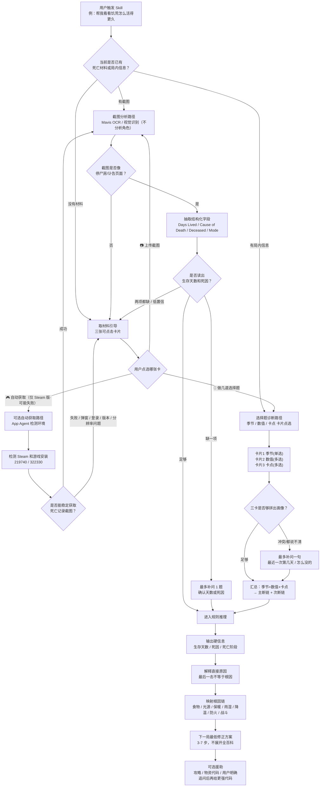
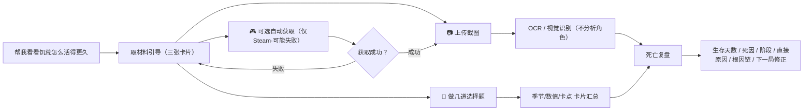

# Mavis 饥荒生存复盘 Skill 判定流程图

这张图描述 Skill 从用户触发到最终输出的完整分支：用户提出想在《饥荒》中活得更久后，Skill 先判断是否已有死亡材料或局内信息；缺少材料时先进入取材料引导，给出三张可点击卡片，让用户选择上传截图、做选择题（季节/数值/卡点），或在环境允许时尝试自动获取死亡记录。第一轮不分析、不分析角色。自动获取只是用户明确选择后的增强路径（仅 Steam 版、需配合等待、可能失败），成功后回到截图分析，失败后回到取材料引导。

## 快速版流程

