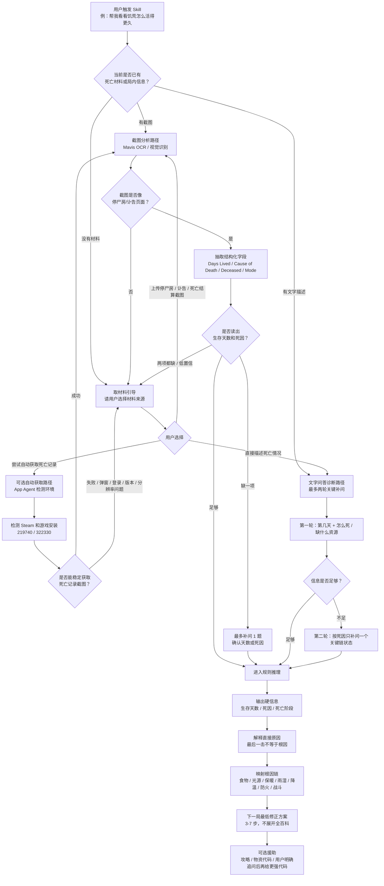
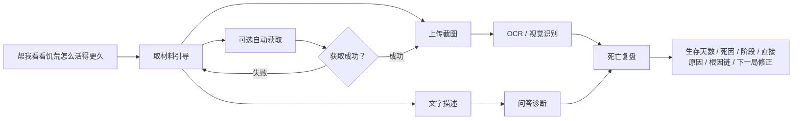

# Mavis 饥荒生存复盘 Skill 判定流程图

这张图描述 Skill 从用户触发到最终输出的完整分支：用户提出想在《饥荒》中活得更久后，Skill 先判断是否已有死亡材料或局内信息；缺少材料时先进入取材料引导，让用户选择上传截图、文字描述，或在环境允许时尝试自动获取死亡记录。自动获取只是用户明确选择后的增强路径，成功后回到截图分析，失败后回到取材料引导。

```mermaid
flowchart TD
    A["用户触发 Skill<br/>例：帮我看看饥荒怎么活得更久"] --> B{"当前是否已有<br/>死亡材料或局内信息？"}

    B -- "有截图" --> C["截图分析路径<br/>Mavis OCR / 视觉识别"]
    B -- "有文字描述" --> D["文字问答诊断路径<br/>最多两轮关键补问"]
    B -- "没有材料" --> E["取材料引导<br/>请用户选择材料来源"]

    E --> E1{"用户选择"}
    E1 -- "上传停尸房 / 讣告 / 死亡结算截图" --> C
    E1 -- "直接描述死亡情况" --> D
    E1 -- "尝试自动获取死亡记录" --> F["可选自动获取路径<br/>App Agent 检测环境"]

    F --> G["检测 Steam 和游戏安装<br/>219740 / 322330"]
    G --> H{"是否能稳定获取<br/>死亡记录截图？"}
    H -- "成功" --> C
    H -- "失败 / 弹窗 / 登录 / 版本 / 分辨率问题" --> E

    C --> I{"截图是否像<br/>停尸房/讣告页面？"}
    I -- "否" --> E
    I -- "是" --> J["抽取结构化字段<br/>Days Lived / Cause of Death / Deceased / Mode"]
    J --> K{"是否读出<br/>生存天数和死因？"}
    K -- "足够" --> P["进入规则推理"]
    K -- "缺一项" --> K1["最多补问 1 题<br/>确认天数或死因"]
    K1 --> P
    K -- "两项都缺 / 低置信" --> E

    D --> D1["第一轮：第几天 + 怎么死 / 缺什么资源"]
    D1 --> D2{"信息是否足够？"}
    D2 -- "足够" --> P
    D2 -- "不足" --> D3["第二轮：按死因只补问一个关键链状态"]
    D3 --> P

    P --> Q["输出硬信息<br/>生存天数 / 死因 / 死亡阶段"]
    Q --> R["解释直接原因<br/>最后一击不等于根因"]
    R --> S["映射根因链<br/>食物 / 光源 / 保暖 / 雨湿 / 降温 / 防火 / 战斗"]
    S --> T["下一局最低修正方案<br/>3-7 步，不展开全百科"]
    T --> U["可选援助<br/>攻略 / 物资代码 / 用户明确追问后再给更强代码"]
```

## 快速版流程

```mermaid
flowchart LR
    A["帮我看看饥荒怎么活得更久"] --> B["取材料引导"]
    B --> C["上传截图"]
    B --> D["文字描述"]
    B --> E["可选自动获取"]
    E --> F{"获取成功？"}
    F -- "成功" --> C
    F -- "失败" --> B
    C --> G["OCR / 视觉识别"]
    D --> H["问答诊断"]
    G --> I["死亡复盘"]
    H --> I
    I --> J["生存天数 / 死因 / 阶段 / 直接原因 / 根因链 / 下一局修正"]
```
